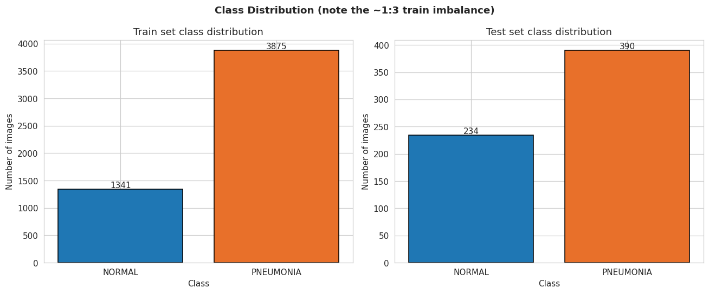
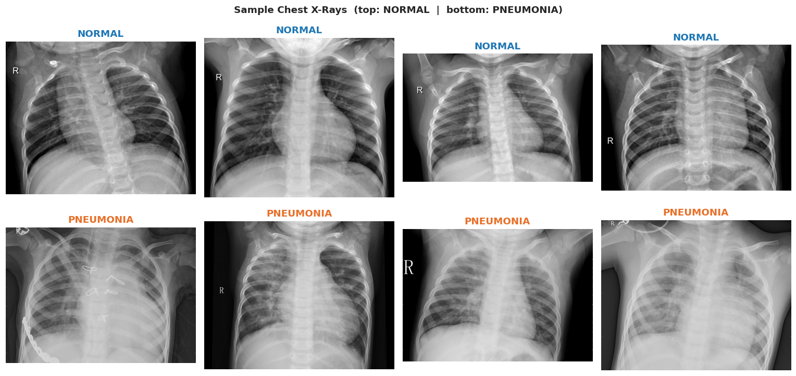
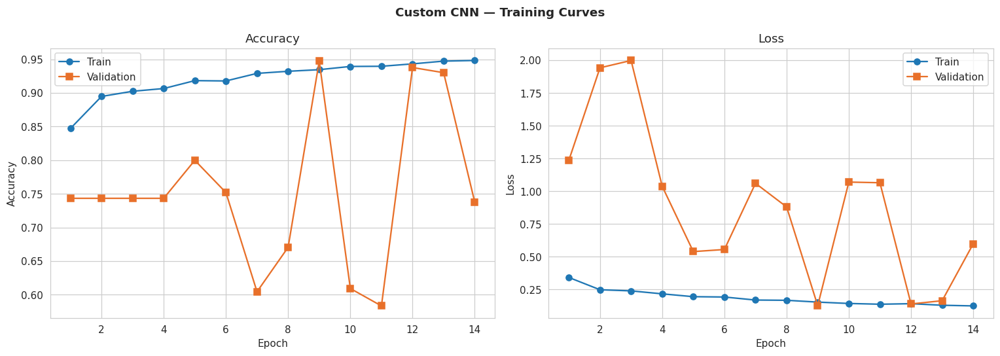
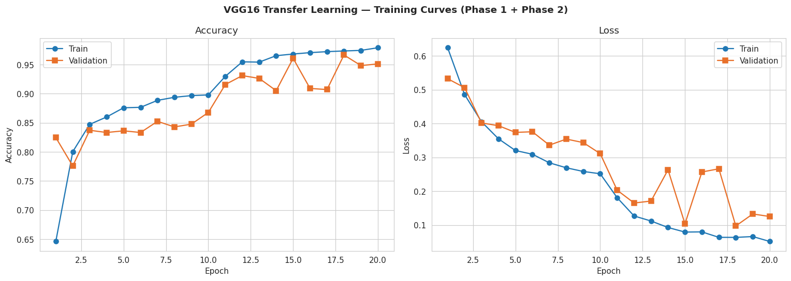
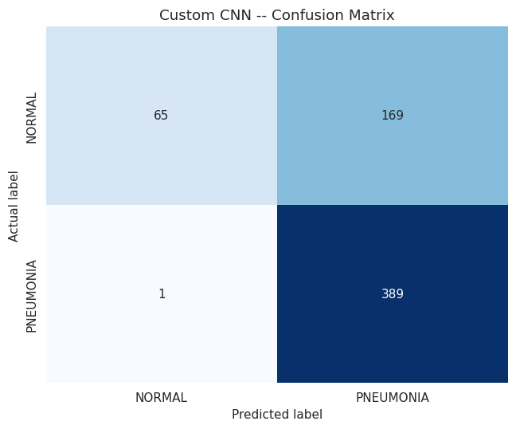
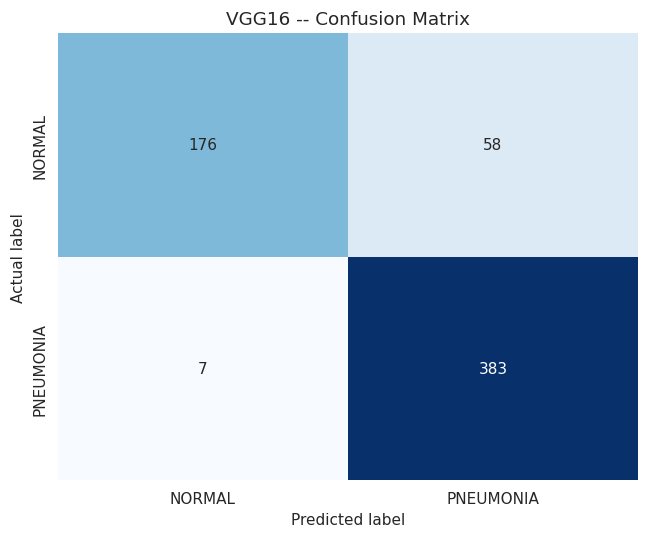
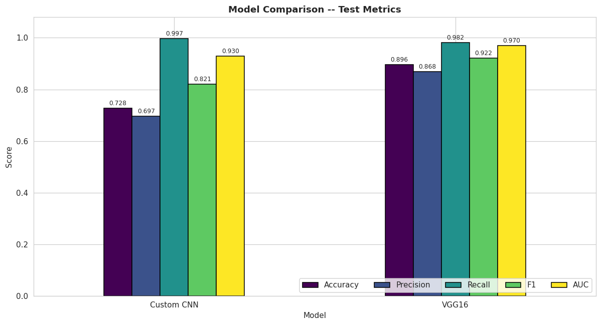
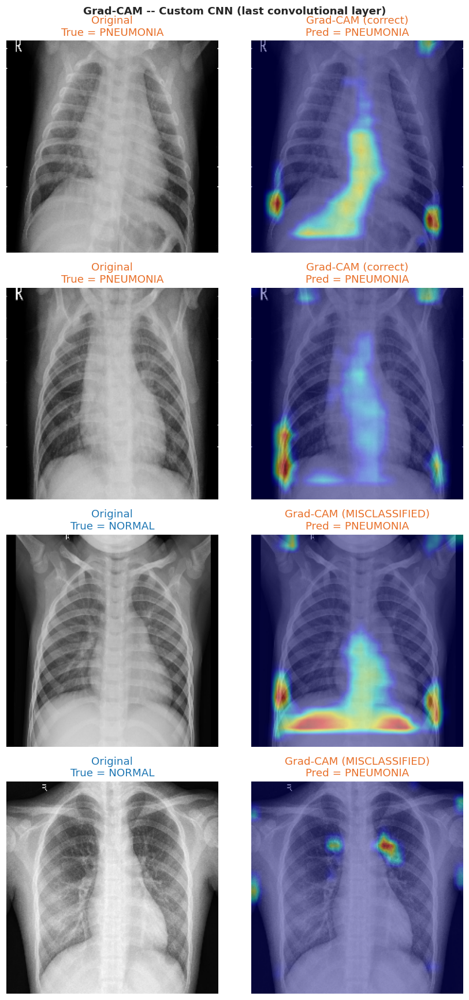

# Custom CNN vs. VGG16 vs. MobileNetV2 for Pneumonia Detection in Chest X-Rays

A recall-oriented comparison of three deep-learning approaches for **binary chest X-ray classification**
(`NORMAL` vs. `PNEUMONIA`): a lightweight CNN trained from scratch, a fine-tuned **VGG16** model,
and a fine-tuned **MobileNetV2** model — evaluated on accuracy, recall, AUC, and deployment efficiency.

**Author:** Ivan Logutov · M.Sc. Data Science, University of Europe for Applied Sciences  
**Supervisor:** Raja Hashim Ali  
**Course:** Machine Learning

📄 **Final report (PDF):** [`Pneumonia_Detection_CNN__VGG16_and_MobileNet_V2___Final_Report.pdf`](Pneumonia_Detection_CNN__VGG16_and_MobileNet_V2___Final_Report.pdf)  
📝 **LaTeX source (IEEE format):** [`overleaf-project/`](overleaf-project/)  
💻 **Code (runnable notebook):** [`notebooks/pneumonia-detection.ipynb`](notebooks/pneumonia-detection.ipynb)

> **Clinical framing:** a missed pneumonia (False Negative) is more dangerous than a false
> alarm, so **Recall / Sensitivity** is the primary metric and **F1** is secondary.

---

## Abstract
Pneumonia is a leading cause of death from infection worldwide, and chest radiography is the
most common test used to confirm it. We compare three deep-learning strategies for detecting
pneumonia from chest X-rays under identical conditions: a lightweight CNN trained from scratch,
a fine-tuned VGG16 transfer-learning model, and a fine-tuned MobileNetV2 transfer-learning model.
All are trained on the Kermany benchmark with a class-weighted loss to handle strong class imbalance,
and interpreted with Grad-CAM and SHAP.
On the held-out test set, VGG16 achieves the highest balanced performance (**0.917 accuracy /
0.936 F1 / 0.969 AUC**), while MobileNetV2 is competitive (**0.905 accuracy / 0.926 F1 / 0.970 AUC**)
at a fraction of the model size (23 MB vs. 112 MB). The custom CNN reaches near-perfect recall
(**1.000**) at the cost of low precision, making it suitable as an aggressive screening filter.

## Research questions
1. How effectively can a lightweight custom CNN detect pneumonia from chest X-rays when trained from scratch on a limited dataset?
2. Does VGG16 transfer learning outperform a custom CNN on the Kermany benchmark?
3. How does MobileNetV2 compare to VGG16 in terms of accuracy, recall, and deployment efficiency?
4. How does a class-weighted loss affect performance given the class imbalance?
5. Can Grad-CAM and SHAP provide interpretable, clinically meaningful explanations of model decisions?
6. What are the recall–accuracy trade-offs, and what do they imply for clinical screening vs. deployment?

## 1. Problem statement
Given a chest X-ray image, predict whether the patient has pneumonia (`PNEUMONIA = 1`) or not
(`NORMAL = 0`). This is a supervised, binary image-classification task addressed with
convolutional neural networks.

## 2. Dataset
- **Name:** Chest X-Ray Images (Pneumonia)
- **Source / link:** https://www.kaggle.com/datasets/paultimothymooney/chest-xray-pneumonia
- **Original paper:** Kermany et al. (2018), *Cell*, DOI: 10.1016/j.cell.2018.02.010
- **Type:** grayscale chest X-ray images (JPEG)
- **Classes (2):** `NORMAL`, `PNEUMONIA`
- **Size:** 5,856 images total

| Split | NORMAL | PNEUMONIA | Total |
|-------|-------:|----------:|------:|
| Train (original) | 1,341 | 3,875 | 5,216 |
| Test  | 234 | 390 | 624 |

**Notes handled in code:**
- The original `val/` split has only 16 images, so a **stratified 80/20 validation split is
  rebuilt from the training set** (read-only safe — no files are copied).
- The training set is imbalanced (~1:2.9), addressed with **class weights**.

## 3. Methodology
- **Preprocessing:** resize all images to **224×224**, replicate grayscale to 3 channels (RGB),
  normalize pixels to `[0, 1]` (`rescale=1/255`).
- **Augmentation (train only, conservative for medical imaging):** horizontal flip, ±10°
  rotation, small width/height shift and zoom. No vertical flip / shear / heavy jitter.
- **Custom CNN:** 4 blocks of `Conv2D → BatchNorm → ReLU → MaxPool` (32→64→128→256) →
  `GlobalAveragePooling → Dense(512) → Dropout(0.5) → Dense(1, sigmoid)`. ~522K parameters.
- **VGG16:** ImageNet backbone + custom head
  (`GlobalAveragePooling → Dense(256) → Dropout(0.4) → Dense(1, sigmoid)`), trained in two
  phases — feature extraction (frozen base) then fine-tuning of the last 4 conv layers (block 5)
  at a lower learning rate. ~14.8M parameters.
- **MobileNetV2:** ImageNet backbone + identical custom head to VGG16
  (`GlobalAveragePooling → Dense(256) → Dropout(0.4) → Dense(1, sigmoid)`), trained in the same
  two-phase protocol. ~2.6M parameters, 23 MB on disk — a practical choice for deployment.
- **Training:** Adam, binary cross-entropy, `class_weight`, callbacks `EarlyStopping` /
  `ReduceLROnPlateau` / `ModelCheckpoint` monitored on **`val_auc`** (a threshold-free metric
  that, unlike recall, cannot be gamed by a model that simply predicts PNEUMONIA for everything).
- **Evaluation:** best saved weights reloaded before testing on the untouched `test/` set;
  metrics are accuracy, precision, recall, F1, AUC-ROC, plus confusion matrices, Grad-CAM,
  and SHAP (Partition explainer with Image masker for Keras 3 compatibility).

## 4. Results (test set)

| Model | Accuracy | Precision | Recall | F1 | AUC |
|-------|:--------:|:---------:|:------:|:--:|:---:|
| Custom CNN | 0.625 | 0.625 | **1.000** | 0.769 | 0.914 |
| **VGG16 (transfer learning)** | **0.917** | **0.901** | 0.974 | **0.936** | 0.969 |
| MobileNetV2 (transfer learning) | 0.905 | 0.903 | 0.951 | 0.926 | **0.970** |

**Key findings**
- **VGG16 leads** on accuracy, precision, and F1; **MobileNetV2** matches it on AUC and is
  only marginally behind on the other balanced metrics.
- Both transfer-learning models generalize far better than the custom CNN trained from scratch
  on ~5k images.
- The Custom CNN achieves **perfect recall (1.000)** — zero missed pneumonia cases — but at the
  cost of very low precision; its AUC of 0.914 shows it still discriminates well, so the issue
  is decision-threshold calibration, not lack of learning.
- **MobileNetV2 is the deployment sweet spot:** 23 MB vs. 112 MB for VGG16, with near-identical
  clinical performance.

## 5. Efficiency metrics

| Model | Size (MB) | Train time (s) | Inference / img (ms) | Throughput (img/s) |
|-------|----------:|---------------:|---------------------:|-------------------:|
| Custom CNN | 6.06 | 920 | 17.0 | 58.7 |
| VGG16 | 111.75 | 1,651 | 24.2 | 41.4 |
| MobileNetV2 | 23.23 | 1,650 | 129.5 | 7.7 |

Raw numbers are in [`efficiency_metrics.csv`](efficiency_metrics.csv).

## 6. Figures
All figures are saved to `figures/` (PNG for raster display, PDF at 300 dpi for the paper).

| | |
|---|---|
| Class distribution |  |
| Sample images |  |
| Model architecture diagram | `figures/architecture.pdf` |
| Workflow diagram | `figures/workflow.pdf` |
| Graphical abstract | `figures/graphical_abstract.pdf` |
| Custom CNN — training curves |  |
| VGG16 — training curves |  |
| MobileNetV2 — training curves | `figures/mobilenetv2_training_curves.pdf` |
| Custom CNN — confusion matrix |  |
| VGG16 — confusion matrix |  |
| MobileNetV2 — confusion matrix | `figures/mobilenetv2_confusion_matrix.pdf` |
| 3-model comparison |  |
| Efficiency comparison | `figures/efficiency_comparison.pdf` |
| Grad-CAM |  |
| SHAP — Custom CNN | `figures/shap_custom_cnn.pdf` |
| SHAP — VGG16 | `figures/shap_vgg16.pdf` |
| SHAP — MobileNetV2 | `figures/shap_mobilenetv2.pdf` |

## 7. Repository structure
```
.
├── notebooks/
│   └── pneumonia-detection.ipynb         # full, runnable pipeline (CNN + VGG16 + MobileNetV2)
├── figures/                              # all generated figures (PNG + PDF)
├── overleaf-project/                     # LaTeX source of the final paper (IEEE format)
│   ├── Report.tex                        # main document
│   ├── bibliography.bib                  # references
│   ├── IEEEtran.cls / IEEEtran.bst       # IEEE template files
│   ├── Figures/                          # figures used in the paper (PDF)
│   ├── Codes/  Dataset/                  # code + dataset link
│   ├── Figure and Table Source Folder/   # editable figure sources + raw-data Excel
│   ├── Literature Review/                # related-work material
│   └── Presentation/                     # presentation assets
├── kaggle-output/                        # trained model weights (generated by running the notebook)
│   ├── best_custom_cnn.keras
│   ├── best_vgg16.keras
│   └── best_mobilenetv2.keras
├── efficiency_metrics.csv                # model size / train time / throughput summary
├── Pneumonia_Detection_CNN__VGG16_and_MobileNet_V2___Final_Report.pdf
├── Proposal_Pneumonia_Detection.pdf      # Phase 1/2 proposal
├── README.md
├── LICENSE
└── .gitignore                            # excludes the dataset and large model files
```
> The dataset (`chest_xray/`, ~2.4 GB) is **intentionally not committed** — download it from
> the Kaggle link above. The trained models are generated by running the notebook.

## 8. How to run
**Kaggle (recommended):**
1. Create a new Kaggle Notebook and *Add Data* → search `chest-xray-pneumonia`
   (`paultimothymooney/chest-xray-pneumonia`).
2. Settings → **Accelerator → GPU**.
3. Open `notebooks/pneumonia-detection.ipynb` and **Run All**. Outputs (models + `figures/`)
   are written to `/kaggle/working/`. The dataset path is auto-detected.

**Local:** install `tensorflow`, `numpy`, `pandas`, `matplotlib`, `seaborn`, `opencv-python`,
`scikit-learn`, `shap`; point the dataset path to your local `chest_xray/` (the notebook
searches for the folder containing `train/NORMAL` and `test/NORMAL`).

## 9. Reproducibility
All random operations are seeded (`SEED = 42`: Python / NumPy / TensorFlow).

## 10. Limitations & future work
Single-source dataset (possible scanner/text artifacts); validation drawn from the train
distribution; all models use a plain `1/255` rescale rather than backbone-native
`preprocess_input`; fixed 0.5 decision threshold. Future work: tune the decision threshold
for a target sensitivity, add dedicated ROC / PR curves, try stronger backbones
(EfficientNet / DenseNet), focal loss, and k-fold cross-validation.

## 11. Key references
- Kermany et al. (2018). *Identifying Medical Diagnoses and Treatable Diseases by Image-Based Deep Learning.* **Cell**, 172(5), 1122–1131.
- Simonyan & Zisserman (2015). *Very Deep Convolutional Networks for Large-Scale Image Recognition.* **ICLR**.
- Howard et al. (2018). *MobileNetV2: Inverted Residuals and Linear Bottlenecks.* **CVPR**.
- Selvaraju et al. (2017). *Grad-CAM: Visual Explanations from Deep Networks via Gradient-Based Localization.* **ICCV**.
- Lundberg & Lee (2017). *A Unified Approach to Interpreting Model Predictions (SHAP).* **NeurIPS**.

The complete reference list is in [`overleaf-project/bibliography.bib`](overleaf-project/bibliography.bib).

## How to cite
```
Logutov, I. (2026). Custom CNN vs. VGG16 vs. MobileNetV2 for Pneumonia Detection in
Chest X-Rays: A Recall-Oriented Comparison. Machine Learning Final Project,
University of Europe for Applied Sciences.
```
